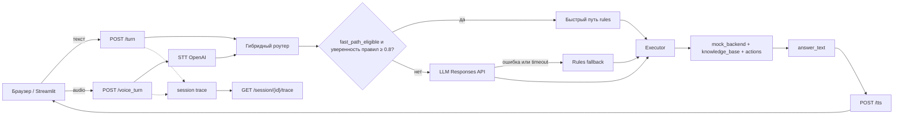

# Sөile — голосовой роутер для Saqta Insurance


Проект для хакатона HackAlem AI, трек Halyk Bank, кейс 2 «Voice Router».

## Оглавление

- [За минуту](#за-минуту)
- [Технологии](#технологии)
- [Запуск](#запуск)
- [Проверка за три минуты](#проверка-за-три-минуты)
- [Как устроен проект](#как-устроен-проект)
- [Объяснимость и контроль AI](#объяснимость-и-контроль-ai)
- [Темп живого разговора](#темп-живого-разговора)
- [Масштабирование](#масштабирование)
- [Границы применимости](#границы-применимости)
- [Соответствие ТЗ](#соответствие-тз)
- [API](#api)
- [Самопроверка README](#самопроверка-readme)
- [Неопределённости](#неопределённости)

## За минуту

Saqta Voice Router — голосовой робот контакт-центра вымышленной страховой компании Saqta Insurance. Для русской, казахской и смешанной речи он выбирает один из 40 страховых сценариев по смыслу, истории и границам соседних сценариев, а не по отдельному intent-классификатору. LLM возвращает структурированный результат: сценарий, confidence, объяснение, альтернативы, действие и отложенные темы. Супервизор видит путь решения, тайминги и причину выбора.

Последний сохранённый live-прогон на 104 репликах: 23 сентября 2026, модель `gpt-4.1-mini`, primary accuracy **97.1%**. В нём 19 реплик прошли fast path с точностью **100.0%** и средним временем **0.8 мс** (P95 **0.9 мс**), 84 — через LLM с точностью **96.4%** и средним `llm_ms` **1614.7 мс** (P95 **2412.7 мс**), ещё 1 — через fallback после недоступности LLM.

История улучшений: **93.3% → 95.2% → 94.2% → 97.1%**.

## Технологии

| Компонент | Технология | Зачем |
|---|---|---|
| Сервер | Python, FastAPI, Uvicorn | HTTP API сессии, turns, trace, STT и TTS |
| LLM-роутер | OpenAI Responses API, structured output, JSON Schema | Выбор сценария по смыслу, истории и границам `not_this_if` |
| GPT-5 | `reasoning` с минимальным уровнем | Поддержка GPT-5 через `OPENAI_MODEL`; значение задаётся в `.env` |
| Голос | OpenAI `gpt-4o-mini-transcribe`/`whisper-1`, `gpt-4o-mini-tts`/`tts-1` | STT и TTS с fallback-моделями |
| Интерфейс | Streamlit | Чат, микрофон, озвучка и панель супервизора |
| Правила | `router/router.py` | Существующий baseline-роутер, fast path и fallback участника 1 |
| Данные кита | JSON-файлы в `voice_router_dataset/` | Сценарии, знания, действия, mock-клиенты и eval-набор |

## Запуск

### Требования

- Python **3.10+**;
- ключ OpenAI в корневом `.env`;
- `uv` необязателен: при его наличии он используется для окружения и установки пакетов;
- сеть для установки зависимостей и обращения к OpenAI.

### macOS / Linux

Команды выполняются из корня репозитория:

```bash
cp .env.example .env
```

Откройте `.env` и впишите `OPENAI_API_KEY`. Затем:

```bash
python3 run.py
```

или:

```bash
bash run.sh
```

`run.py` сам создаёт `.venv`, устанавливает `requirements.txt`, проверяет порты и запускает оба процесса:

- интерфейс: <http://127.0.0.1:8501>;
- FastAPI Swagger: <http://127.0.0.1:8000/docs>.

### Windows

Из корня репозитория:

```bat
copy .env.example .env
```

Впишите `OPENAI_API_KEY` в `.env`, затем запустите:

```bat
py -3 run.py
```

или:

```bat
run.cmd
```

Адреса те же: <http://127.0.0.1:8501> и <http://127.0.0.1:8000/docs>.

Если порт занят, задайте другие значения.

```bash
PORT=8001 STREAMLIT_PORT=8502 python3 run.py
```

```bat
set PORT=8001
set STREAMLIT_PORT=8502
py -3 run.py
```

`run.py` проверяет порты средствами Python и останавливает backend и Streamlit по `Ctrl+C`. Streamlit запускается с `--server.headless true --browser.gatherUsageStats false`, поэтому email при первом запуске не запрашивается.

Микрофон браузера работает на `localhost`/`127.0.0.1` или по HTTPS. Если ключа нет или он недействителен, интерфейс покажет ошибку; текстовый ввод и локальный режим-резерв останутся доступны.

## Проверка за три минуты

В интерфейсе по умолчанию выбран режим **OpenAI · backend**. Клиент может написать текст, нажать микрофон и выбрать «Распознать запись». Ответ озвучивается через TTS. В правой панели супервизор видит сценарий, confidence, объяснение, альтернативы, путь решения, действие, pending topics и тайминги.

Проверьте по одной реплике за раз:

| Реплика | Ожидаемый результат |
|---|---|
| «Сколько стоит ОГПО на машину?» | `SC01`, цена ОГПО |
| «Сәлеметсіз бе, мекенжайымды өзгерткім келеді» | `SC29`, изменение контактных данных |
| «Сәлеметсіз бе, мне нужно поменять адрес в полисе» | `SC29`, изменение контактных данных |
| «Попал в аварию и ещё адрес поменять надо» | основным становится срочный `SC11`, адрес остаётся отложенной темой |
| «Алло, я по поводу страховки» | `SYS_UNCLEAR`, уточняющий вопрос |
| «Какая погода завтра?» | `SYS_OUT_OF_SCOPE`, вне тематики страхования |
| «Соедините с оператором» | передача оператору, `action=handoff` |

Многошаговая проверка:

```bash
python3 scripts/demo_dialog.py
```

В Windows:

```bat
py -3 scripts/demo_dialog.py
```

Скрипт берёт тестовый телефон из `voice_router_dataset/mock_backend.json`, создаёт сессию и печатает по одной строке на реплику:

```text
router_mode | scenario_id | confidence | action | answer_text | llm_ms
```

Диалог показывает распознавание телефона, сохранение параметра, подтверждение действия, возврат к отложенной теме, переход на казахский и передачу оператору. Если backend не запущен, скрипт временно поднимает его сам.

Для самостоятельной оценки 104 реплик:

```bash
./.venv/bin/python scripts/eval_router.py --workers 8
```

```bat
.venv\Scripts\python.exe scripts\eval_router.py --workers 8
```

Для сравнения модели без изменения `.env`:

```bash
./.venv/bin/python scripts/eval_router.py --model gpt-5-mini --workers 8
```

Новый live-результат дописывается в `docs/eval_results.md`.

## Как устроен проект



### Компоненты

- [`backend/app.py`](backend/app.py) хранит сессии в памяти, принимает текстовые turns, передаёт историю и `current_scenario` роутеру, вызывает executor и записывает trace.
- [`backend/llm_router.py`](backend/llm_router.py) строит каталог сценариев из `scenarios.json`, вызывает OpenAI Responses API по JSON Schema, поддерживает GPT-5 reasoning, фильтрует pending topics и делает rules fallback при ошибке/таймауте.
- [`backend/router_client.py`](backend/router_client.py) нормализует параметры и безопасно превращает исключение роутера в handoff.
- [`backend/executor.py`](backend/executor.py) выполняет mock-действия по сценарию, использует `knowledge_base.json`, `mock_backend.json` и `actions.json`, задаёт вопросы для недостающих параметров и ждёт подтверждение необратимых операций.
- [`backend/speech.py`](backend/speech.py) содержит `/stt`, `/tts` и `/voice_turn`. STT использует `gpt-4o-mini-transcribe` с fallback на `whisper-1`; TTS — `gpt-4o-mini-tts` с fallback на `tts-1`. В TTS передаётся уже сформированный ответ на языке клиента; основная TTS-модель получает инструкцию говорить на языке входного текста, а fallback `tts-1` использует сам текст без отдельной language-параметризации.
- [`Soile-Voice-Router/app.py`](Soile-Voice-Router/app.py) — текущий Streamlit-интерфейс. Он читает корневой `.env`, отправляет текст/аудио в backend, показывает панель супервизора и озвучивает ответ.
- [`router/router.py`](router/router.py) — зона участника 1: детерминированный baseline с тем же контрактом `route_dialogue(utterance, history, current_scenario)`.
- [`run.py`](run.py) — единый кроссплатформенный запускатель.

`Soile-Avatar/` присутствует в репозитории как отдельная версия интерфейса с аватаром, но текущий единый `run.py` запускает `Soile-Voice-Router/app.py`.

### Почему это не intent-классификатор

Основное решение принимает LLM по каталогу сценариев, их описаниям, границам `not_this_if`, истории и текущему сценарию. Правила используются для явно разрешённого fast path (`fast_path_eligible`) и как страховка при сбое LLM. Безопасная регулярка оператора обрабатывает только явную просьбу соединить с человеком. В коде нет правил, составленных под отдельные проверочные реплики из eval-набора; `dev_utterances.json` не загружается роутером во время работы.

## Объяснимость и контроль AI

Пример структуры ответа `/turn` (значения иллюстративны):

```json
{
  "scenario_id": "SC11",
  "confidence": 0.86,
  "reasoning": "Клиент сообщает о ДТП, произошедшем сейчас.",
  "alternatives": [{"id": "SC29", "confidence": 0.42}],
  "params": {"contact_field": "address"},
  "action": "answer",
  "pending_topics": ["SC29"],
  "answer_text": "Сначала разберём срочное ДТП.",
  "router_mode": "llm",
  "timings_ms": {
    "session_lookup": 0.01,
    "routing": 1200.0,
    "llm_ms": 1198.0,
    "executor_ms": 0.4,
    "save": 0.01,
    "total": 1201.0
  }
}
```

| Поле | Смысл |
|---|---|
| `scenario_id` | Основной сценарий из каталога, включая `SYS_*` |
| `confidence` | Уверенность маршрутизации от 0 до 1 |
| `reasoning` | Короткое объяснение на русском |
| `alternatives` | До трёх альтернатив с confidence |
| `params` | Извлечённые параметры для executor |
| `action` | `answer`, `clarify`, `confirm` или `handoff` после политики executor |
| `pending_topics` | Дополнительные темы, к которым можно вернуться |
| `answer_text` | Ответ клиенту на русском или казахском |
| `router_mode` | `llm`, `fast_path` или `rules_fallback` |
| `timings_ms` | Этапы обработки и общее время |

Если confidence ниже 0.6 или сценарий требует уточнения, executor задаёт один вопрос. После двух неудачных уточнений формируется handoff с контекстом. Если клиент сам просит оператора, запрос передаётся оператору. Необратимые операции из `actions.json` сначала возвращают `confirm` и выполняются только после «да», «иә» или другого явного подтверждения.

## Темп живого разговора

Система хранит контекст в сессии: последние реплики, текущий сценарий, параметры и `pending_topics`. Телефон или другой параметр, названный один раз, сохраняется и не должен запрашиваться снова. При нескольких темах срочные сценарии (например, ДТП, болезнь за границей или мошенничество) ставятся первыми, остальные сохраняются для возврата. Поддерживаются русский, казахский и смешанная речь.

Измеряются session lookup, routing, `llm_ms`, executor, save, STT, TTS и total на соответствующих путях. В последнем live-прогоне fast path занял в среднем 0.8 мс, LLM — 1614.7 мс. Ориентир ТЗ — до 500 мс для выбора сценария и до 1.5 с до ответа; 500 мс достигаются на fast path, но средний LLM-путь в текущем прогоне медленнее 1.5 с. TTS и STT зависят от внешнего API и сети.

## Масштабирование

Каталог для LLM загружается из `voice_router_dataset/scenarios.json`, поэтому добавление описания, границ, примеров и `fast_path_eligible` не требует переписывать сам промпт или роутер. Для нового исполняемого действия также потребуются запись в `actions.json`, знания в `knowledge_base.json` и поддержка действия в executor.

Модель меняется через `OPENAI_MODEL` в корневом `.env` или для eval через `--model`. GPT-5 распознаётся по имени и получает минимальный уровень reasoning. Для production потребуются внешнее хранилище сессий вместо dict процесса, очередь/фоновые задачи для медленных операций, мониторинг OpenAI и метрик latency, а также единый поток trace для фронтенда.

## Границы применимости

- Accuracy измерена на 104 репликах dev-набора организаторов; на новых формулировках результат может быть ниже.
- В последнем live-прогоне fast path дал 100%, но это не гарантия на незнакомых формулировках.
- Известные ошибки последнего прогона: статус платежа был выбран как `SC30` вместо `SC17`; мультиинтент с КАСКО и ОГПО выбрал `SC01` вместо `SC03`; запись к ЛОРу с вопросом о покрытии выбрала `SC22` вместо `SC21`.
- Сессии хранятся только в памяти одного процесса и теряются после перезапуска.
- Данные клиентов, полисов, платежей и знаний синтетические; реальные персональные данные в репозитории не используются.
- Для работы нужны внешние OpenAI API; задержка зависит от сети, модели и квоты.
- Качество STT на казахском и смешанной речи зависит от аудио и модели распознавания.
- Потоковая обработка аудио и распознавание эмоций не реализованы.

## Соответствие ТЗ

| Требование | Как выполнено | Где |
|---|---|---|
| Голос в вебе | `st.audio_input` → `/stt` или `/voice_turn` → `/tts` | `Soile-Voice-Router/app.py`, `backend/speech.py` |
| LLM-слой | Responses API, JSON Schema, история и каталог сценариев | `backend/llm_router.py` |
| Корректность маршрутизации | eval на 104 репликах, fast path и LLM-метрики | `scripts/eval_router.py`, `docs/eval_results.md` |
| Панель трассировки | Сценарий, confidence, reasoning, alternatives, action, режим, pending, timing | `Soile-Voice-Router/app.py`, `/session/{id}/trace` |
| RU/KZ | Язык определяется для STT и executor; TTS получает ответ на языке клиента | `backend/speech.py`, `backend/executor.py` |
| Объяснимость | `reasoning`, confidence, alternatives, `router_mode`, trace | `backend/llm_router.py`, `backend/app.py` |
| Handoff | Явная просьба оператора и две неудачные попытки уточнения | `backend/llm_router.py`, `backend/executor.py` |
| Подтверждения | Необратимые actions сначала требуют подтверждения | `backend/executor.py`, `voice_router_dataset/actions.json` |
| Запуск одной командой | `python run.py`, `bash run.sh`, `run.cmd` | `run.py`, `run.sh`, `run.cmd` |
| Измерение latency | STT/LLM/routing/executor/TTS/total | `backend/app.py`, `backend/speech.py` |
| Приватность ключа | Ключ только в корневом `.env`, `.env` в `.gitignore` | `.env.example`, `.gitignore` |
| Масштабируемость | JSON-каталог и отдельные backend-компоненты | `voice_router_dataset/`, `backend/` |
| Streaming STT/TTS | Не реализован | — |
| Распознавание эмоций | Не реализовано | — |
| Устойчивое хранилище сессий | Не реализовано: сейчас dict в памяти | `backend/app.py` |

## API

| Метод | Endpoint | Назначение |
|---|---|---|
| `POST` | `/session` | Создать сессию и получить `session_id` |
| `POST` | `/turn` | Обработать текстовую реплику |
| `POST` | `/stt` | Преобразовать webm/ogg/wav/mp3 в текст |
| `POST` | `/tts` | Получить mp3 по тексту; время в заголовке `tts_ms` |
| `POST` | `/voice_turn` | STT и обработка голосовой реплики в одной операции |
| `GET` | `/session/{session_id}/trace` | Получить trace решений сессии |

После запуска полная OpenAPI-документация доступна по адресу <http://127.0.0.1:8000/docs>. Отдельного `docs/API.md` в репозитории нет.

## Структура репозитория

```text
backend/                 FastAPI, LLM-адаптер, executor, STT/TTS
router/                  baseline rules участника 1
Soile-Voice-Router/      текущий Streamlit UI
Soile-Avatar/            отдельная версия UI с аватаром
scripts/                 eval, demo-dialog и контрактные тесты
docs/                    результаты live-eval
voice_router_dataset/    scenarios, actions, knowledge base, mock и eval
run.py                   кроссплатформенный запуск backend + Streamlit
run.sh / run.cmd         тонкие оболочки запуска
requirements.txt         зависимости проекта
```

## Безопасность

`OPENAI_API_KEY` хранится только в корневом `.env`; файл исключён из Git. В репозитории используются синтетические клиенты, полисы, платежи и адреса из mock-данных. Не вставляйте реальные персональные данные в eval, demo или issue. В production нужно добавить секрет-хранилище, а не передавать ключи через исходники или логи.


